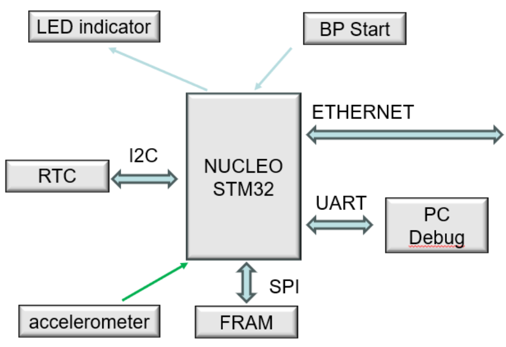
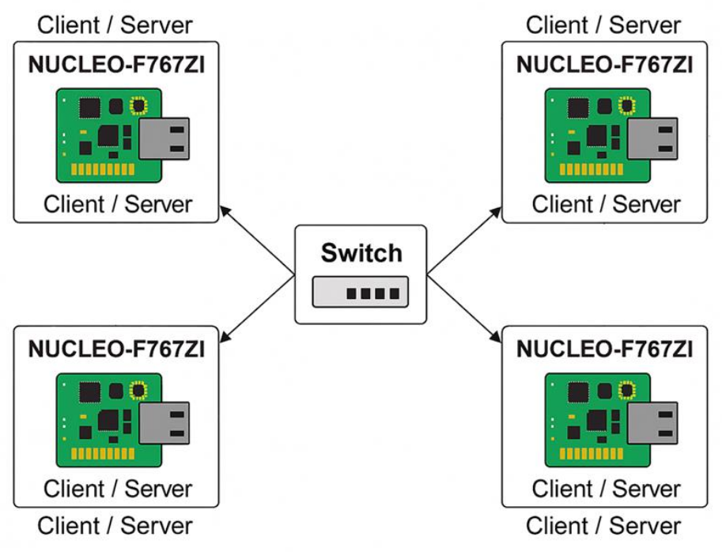

# Seismic Sensor

Seismic sensor is a development project in as part of the Electronical Engineering's degree programme.

This project aims to design a distributed embedded system capable of detecting seismic shocks and earthquakes inside a building.

## Software

The project is developed in C with [FreeRTOS](https://www.freertos.org/) through the [CMSIS-RTOS v1](https://arm-software.github.io/CMSIS_5/RTOS/html/index.html) API on the [STM32CubeIDE](https://www.st.com/en/development-tools/stm32cubeide.html).

## Hardware

Each system node consists of a Nucleo STM32 development board, an analog 3-axis accelerometer, a realtime clock and an external FRAM.

* [Nucleo F767ZI - STM32 Development Board](https://www.st.com/en/evaluation-tools/nucleo-f767zi.html)
* [ADXL337 - Analog 3-axis Acceleromter](https://www.analog.com/en/products/adxl337.html)
* [MikroE RTC 3 Click - I²C Realtime Clock](https://www.mikroe.com/fram-2-click)
* [MikroE FRAM 2 Click - SPI FRAM](https://www.mikroe.com/fram-2-click)

The systems nodes are connected to each other on the Ethernet level with a layer-2 network switch.

The node sends logging and debugging data to the PC via UART through the ST-LINK interface. 

    

## System capabilities

Every node is capable of measuring seismic shocks locally.

Every node broadcasts its presence periodically on the network and is capable of detecting other nodes.

Each node can act as a point-to-point server or client to exchange data and measuremnts.

All exchanged data between nodes is formatted in JSON messages.

Each node can be connected to a PC for logging and debugging purposes.

    

## License

Seismic Sensor is subject to an [MIT license](https://choosealicense.com/licenses/mit/).